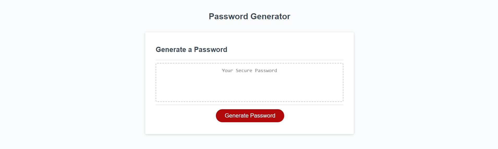

# JS-Password-Gen

## Description

An script allows an employee can use to generate a random password based on criteria they’ve selected. This app will run in the browser, and will feature dynamically updated HTML and CSS powered by JavaScript.

The application will: 

* Generate a password when the button is clicked
  * Present a series of prompts for password criteria
    * Length of password
      * At least 10 characters but no more than 64.
    * Character types
      * Lowercase
      * Uppercase
      * Numeric
      * Special characters ($@%&*, etc)
  * Code validates for each input and at least one character type should be selected
  * Once prompts are answered then the password should be generated and displayed in an alert or written to the page

## Installation

N/A

## Usage

View the completed project below on the deployed link. A screenshot has also been added.

 
  

   

[Link to the finished deployed website](https://gavinaldred.github.io/JS-Password-Gen/)

## Credits

N/A

## License

Please refer to the LICENSE in the repo.

---

## Badges
